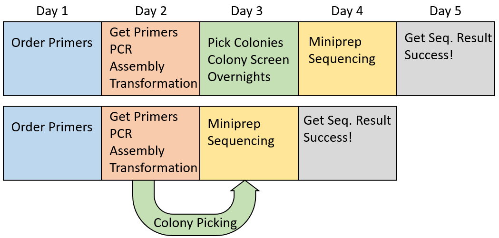

# BioPick

BioPick is an open source purpose-built colony picking robot. The idea is to shorten the time from conception to realization of molecular cloning, by allowing automated colony growth and picking as soon as the colonies are grown into liquid culture, to save a day of growth time.
Key features of BioPick are:

1. low profile design
2. multi-plate capacity
3. plate moving and handling capability
4. on board liquid culture shaker
5. metal picking needle that is sterilized by induction heating
6. Off the shelf 3d printer electronics
7. Raspberry Pi camera for colony identification

BioPick is under development so many things can change.
